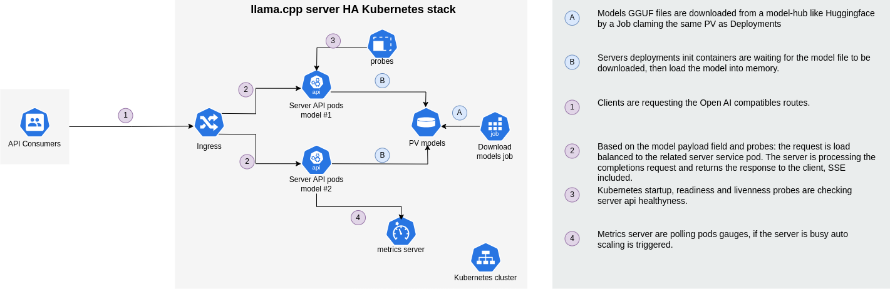

# llama.cpp/example/kubernetes


## Setup kubernetes

You can use microk8s to setup a kubernetes cluster on your local machine. 

Once downloaded enable the following addons for the cluster:

```shell
microk8s enable dns storage registry helm3 gpu
```

You can also set up your system to use the microk8s kubectl [here](https://microk8s.io/docs/working-with-kubectl).


## Usage

This example demonstrates how to deploy [llama.cpp server](../server) on a [kubernetes cluster](https://kubernetes.io).



We provide an [Helm chart](https://helm.sh/)  repository to deploy llama.cpp at scale for completions and embeddings:

```shell

helm repo add llama.cpp https://ggerganov.github.io/llama.cpp
helm repo update
helm install example llamacpp --namespace llama-cpp --create-namespace
```

This chart features 2 subcharts that can be deployed independently:
1. modelRunner: Responsible for completion
2. embeddings: Responsible for embeddings

In order to set the various parameters for the deployment, you can use the `values.yaml` file:

```yaml

modelRunner:
  fullname: "modelrunner"
  service:
    type: ClusterIP
    port: 8080
  modelPath: 
    val: <Path to local>
  models: {
    "model1":{
      "enabled": true,
      "download": true,
      "replicas": 3,
      "device": "cpu",
      "autoScale": {
        "enabled": false,
        "minReplicas": 1,
        "maxReplicas": 100,
        "targetCPUUtilizationPercentage": 80
      },
      "url": "https://huggingface.co/TheBloke/CapybaraHermes-2.5-Mistral-7B-GGUF/resolve/main/capybarahermes-2.5-mistral-7b.Q4_0.gguf",
      "image": "ghcr.io/ggerganov/llama.cpp:server",
      "endpoint": "/model1"
    }  
  }

```

Adjust the model path to a local directory that stores the models. The models are downloaded from the provided URL and stored in the local directory. The models are then mounted to the pod.

You can also adjust the number of replicas, the device, the image, the endpoint, and the autoscaling parameters.


### Metrics monitoring

You might want to deploy prometheus helm chart:

```shell
helm repo add prometheus-community https://prometheus-community.github.io/helm-charts
helm repo update
helm install \
    --set prometheus.prometheusSpec.podMonitorSelectorNilUseHelmValues=false \
    kube-prometheus-stack prometheus-community/kube-prometheus-stack \
    --create-namespace \
    --namespace monitoring
```


## Feature set for the Helm chart

- [x] High availability
- [x] Multi models
- [x] Support of embeddings and completions models
- [ ] Load balancing
- [x] Auto scaling
- [x] CUDA support
- [x] Downloading functionality

## Pending testing

- [ ] Load balancing
- [ ] multi GPU support using MiG for kubernetes [docs](https://docs.nvidia.com/datacenter/tesla/mig-user-guide/index.html) & [microk8s](https://microk8s.io/docs/addon-gpu)


